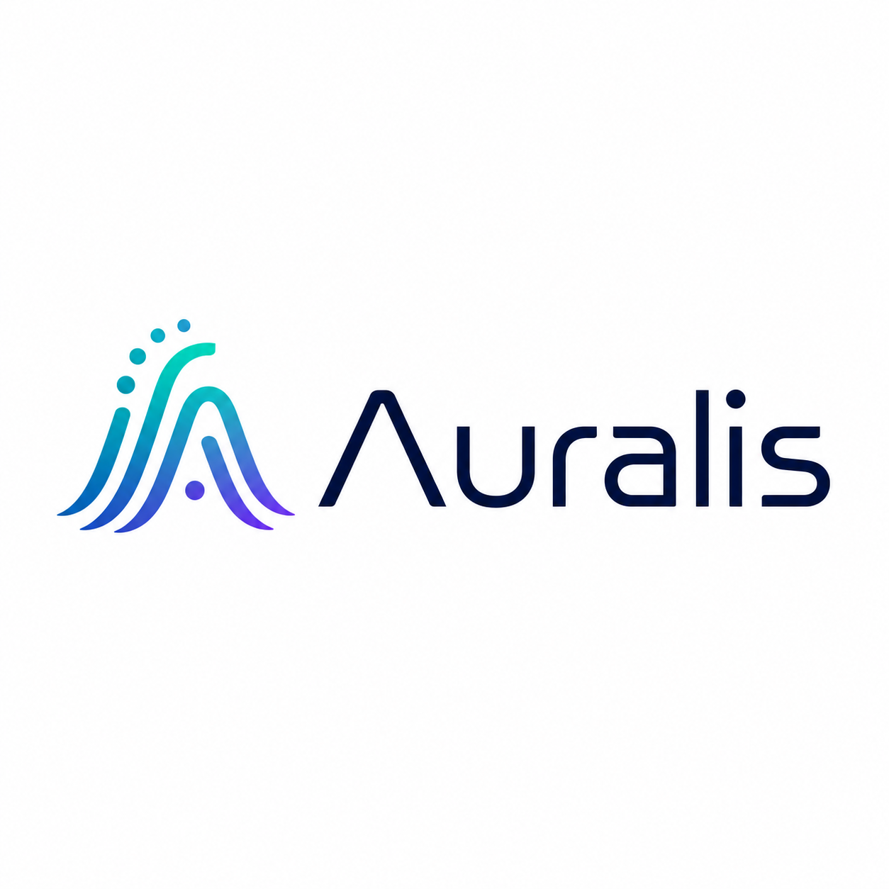

<div align="center">
  

  <h1>Auralis AI</h1>
  <p><strong>Biến website thành một kênh tư vấn và chăm sóc khách hàng bằng AI hoạt động 24/7.</strong></p>

  <p>
    Thu thập tri thức từ website · Trả lời theo dữ liệu doanh nghiệp · Chuyển tiếp cho nhân viên · Quản lý nhiều website trên một nền tảng
  </p>
</div>

---

## Auralis AI giải quyết điều gì?

Khách hàng thường rời website khi không tìm thấy câu trả lời đủ nhanh. Trong khi đó, đội ngũ tư vấn phải lặp lại những câu hỏi giống nhau, bỏ lỡ khách ngoài giờ và khó theo dõi toàn bộ hành trình hội thoại.

Auralis AI giúp doanh nghiệp:

- Tự động tư vấn khách hàng dựa trên nội dung thật của website.
- Phục vụ liên tục 24/7 mà không làm tăng tải công việc thủ công.
- Thu thập lead và chuyển hội thoại cho nhân viên khi khách cần hỗ trợ trực tiếp.
- Quản lý nhiều website, chatbot và nguồn dữ liệu trong cùng một dashboard.
- Theo dõi hiệu quả hội thoại để cải thiện nội dung và quy trình bán hàng.
- Chủ động lựa chọn nhà cung cấp AI hoặc sử dụng API riêng.

## Năng lực sản phẩm

| Nhóm chức năng | Giá trị mang lại |
|---|---|
| **AI theo dữ liệu doanh nghiệp** | Crawl website, lập chỉ mục nội dung và tạo câu trả lời có ngữ cảnh bằng RAG. |
| **Quản lý đa website** | Mỗi website có dữ liệu, cấu hình chatbot, lịch sử crawl và hội thoại riêng. |
| **Chat widget tùy biến** | Điều chỉnh màu sắc, lời chào, vị trí, thương hiệu và nhúng bằng một đoạn script. |
| **Handoff cho nhân viên** | Chuyển từ AI sang hỗ trợ trực tiếp khi cuộc trò chuyện cần con người xử lý. |
| **Quản lý hội thoại và lead** | Theo dõi nội dung trao đổi, trạng thái xử lý và thông tin khách hàng tiềm năng. |
| **Training và Quick Prompts** | Bổ sung Q&A, hướng dẫn hành vi và câu hỏi gợi ý cho chatbot. |
| **Trigger chủ động** | Hiển thị thông điệp theo hành vi hoặc ngữ cảnh của khách truy cập. |
| **Phân tích vận hành** | Quan sát lưu lượng hội thoại, chất lượng phản hồi và hiệu quả từng website. |
| **Đội ngũ và phân quyền** | Chủ tài khoản có thể mời nhân viên tham gia vận hành và xử lý handoff. |
| **Bảo mật theo website** | Kiểm soát domain được phép nhúng và cô lập dữ liệu theo từng site. |

## Phù hợp với ai?

- Doanh nghiệp bán hàng hoặc cung cấp dịch vụ qua website.
- Đơn vị có nhiều thương hiệu, chi nhánh hoặc website cần quản lý tập trung.
- Agency triển khai chatbot cho nhiều khách hàng.
- Đội ngũ chăm sóc khách hàng muốn tự động hóa câu hỏi lặp lại.
- Doanh nghiệp cần tự chủ dữ liệu hoặc muốn sử dụng API model riêng.

## Mô hình thương mại dự kiến

| Gói | Đối tượng | Định hướng |
|---|---|---|
| **Starter** | Cá nhân và doanh nghiệp nhỏ | Bắt đầu nhanh với một website và các tính năng chatbot cốt lõi. |
| **Growth** | Đội ngũ đang tăng trưởng | Nhiều website hơn, handoff, lead và phân tích nâng cao. |
| **Business** | Doanh nghiệp có quy trình vận hành | Hạn mức lớn, quản lý đội ngũ, ưu tiên hỗ trợ và tùy biến thương hiệu. |
| **Custom / BYOK** | Doanh nghiệp cần chủ động chi phí AI | Khách hàng sử dụng API key và nhà cung cấp model của riêng mình. |

> Bảng trên mô tả định hướng đóng gói sản phẩm. Hệ thống billing và giới hạn theo gói cần được hoàn thiện trước khi mở bán chính thức.

## Kiến trúc

```text
Website khách hàng
       │
       └── chatbot.js
              │
              ▼
        FastAPI Backend
          ├── Xác thực và phân quyền
          ├── Crawl và lập chỉ mục
          ├── RAG / AI providers
          ├── Hội thoại, lead, handoff
          └── MongoDB + Vector store
              ▲
              │
       Next.js Dashboard
```

### Công nghệ chính

- **Web app:** Next.js, React, TypeScript
- **API:** FastAPI, Python
- **Dữ liệu:** MongoDB
- **AI/RAG:** kiến trúc provider, hỗ trợ thay đổi model và vector store
- **Widget:** JavaScript nhúng độc lập trên từng website

Mỗi widget gửi `site_id` riêng về backend. Backend dùng định danh này để lấy đúng cấu hình, nguồn tri thức, hội thoại và chính sách bảo mật của website tương ứng.

## Chạy dự án ở local

### Yêu cầu

- Python 3.10 trở lên
- Node.js 20 trở lên
- MongoDB

### 1. Backend

```bash
cd backend
python -m venv .venv
```

Windows:

```powershell
.\.venv\Scripts\Activate.ps1
pip install -r requirements.txt
Copy-Item .env.example .env
uvicorn app.main:app --reload
```

Linux/macOS:

```bash
source .venv/bin/activate
pip install -r requirements.txt
cp .env.example .env
uvicorn app.main:app --reload
```

API mặc định chạy tại `http://localhost:8000`. Swagger UI có tại `http://localhost:8000/docs`.

### 2. Next.js web app

```bash
cd web
npm install
```

Tạo `web/.env.local`:

```env
NEXT_PUBLIC_API_URL=http://localhost:8000
```

Sau đó chạy:

```bash
npm run dev
```

Web app mặc định có tại `http://localhost:3000`.

## Kiểm tra trước khi triển khai

```bash
cd web
npm run lint
npm run build
```

```bash
cd backend
pytest
```

Trước khi cập nhật production, nên:

1. Sao lưu MongoDB.
2. Ghi lại commit hiện đang chạy bằng `git rev-parse HEAD`.
3. Pull đúng nhánh hoặc tag đã kiểm thử.
4. Build lại Next.js khi giao diện thay đổi.
5. Restart backend và web service.
6. Kiểm tra đăng nhập, danh sách website, crawl, chatbot và handoff.

## Triển khai production

Dự án hiện hỗ trợ mô hình triển khai self-hosted:

- Backend FastAPI chạy bằng systemd/Uvicorn.
- Next.js chạy như một service riêng.
- Reverse proxy định tuyến domain đến web app và `/api` đến backend.
- MongoDB được giữ trong hạ tầng của doanh nghiệp.

Tên service và database cũ có thể tiếp tục được giữ để bảo đảm tương thích khi nâng cấp. Việc đổi thương hiệu hiển thị sang Auralis AI không yêu cầu đổi database hoặc di chuyển dữ liệu.

## Trạng thái sản phẩm

Auralis AI đang trong giai đoạn hoàn thiện để vận hành thương mại. Các ưu tiên tiếp theo nên gồm:

- Billing, subscription và giới hạn sử dụng theo gói.
- Quản lý API key/model riêng cho gói Custom.
- Email xác minh, quên mật khẩu và quản lý phiên đăng nhập.
- Giám sát lỗi, audit log, backup tự động và cảnh báo vận hành.
- Kiểm thử end-to-end cho các luồng đăng nhập, crawl, chat và handoff.

## Bản quyền

Mã nguồn kế thừa giấy phép trong [LICENSE](LICENSE). Trước khi phân phối thương mại hoặc cung cấp dưới dạng SaaS, cần rà soát lại quyền sử dụng của toàn bộ dependency, asset và mã nguồn kế thừa.
